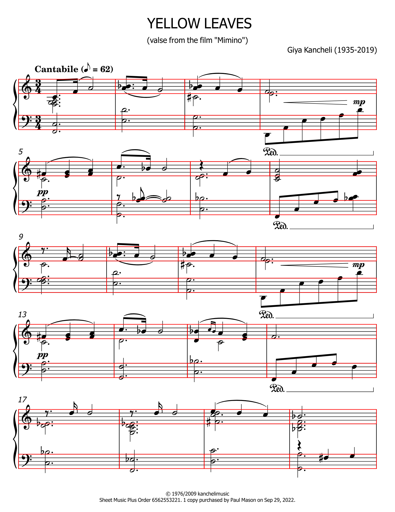
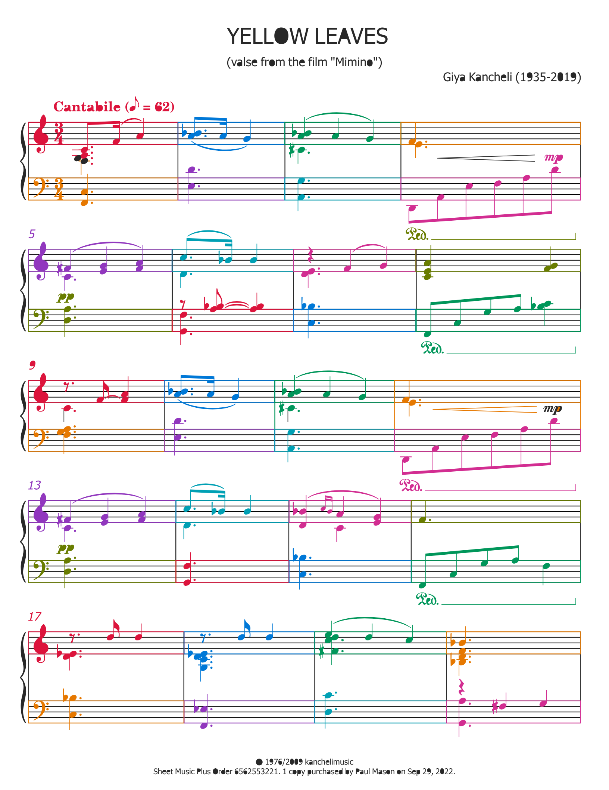
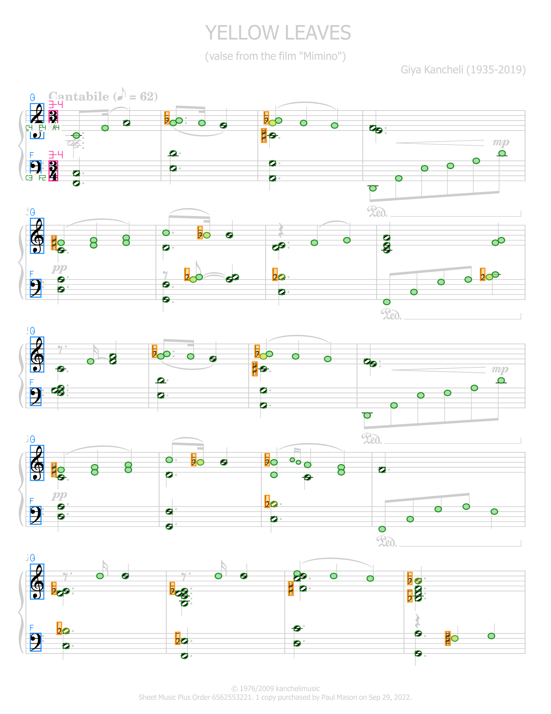
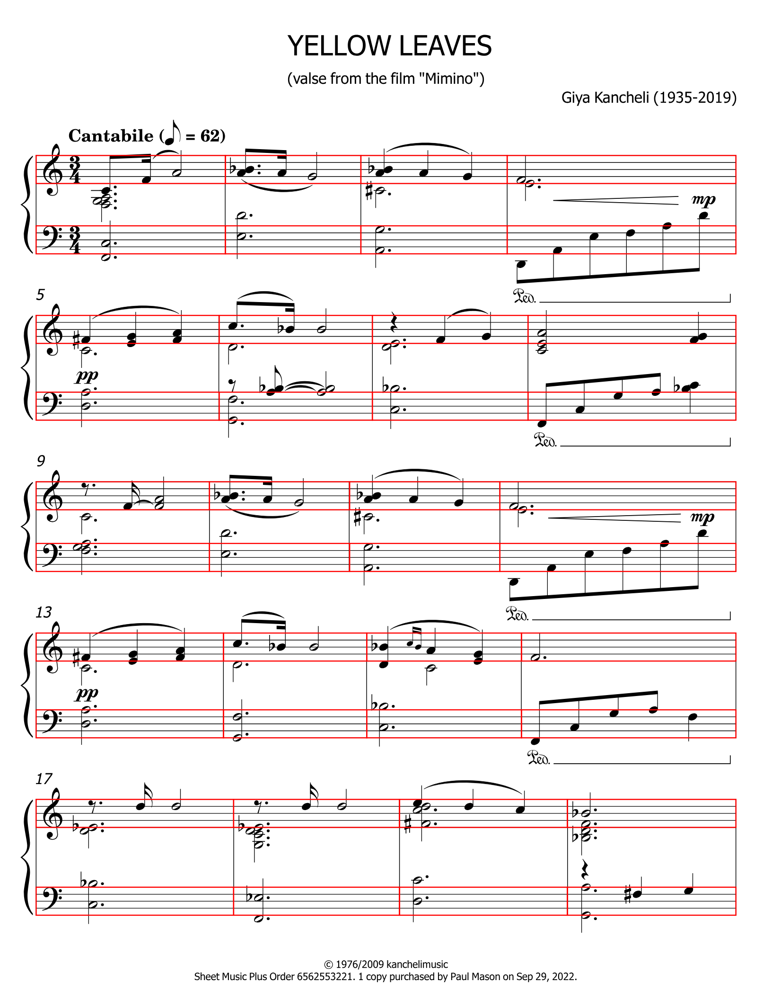
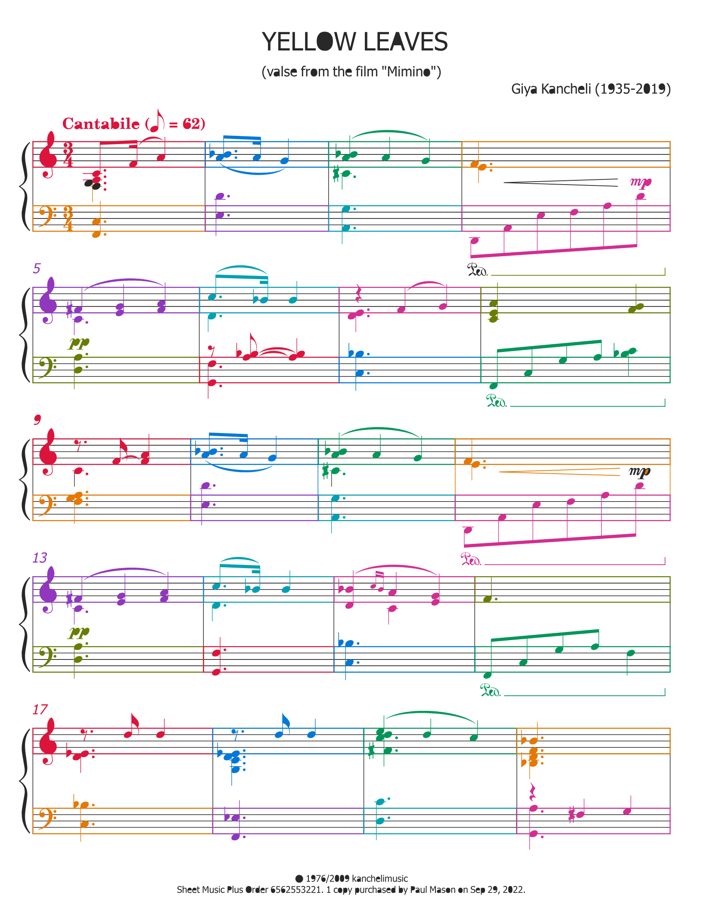
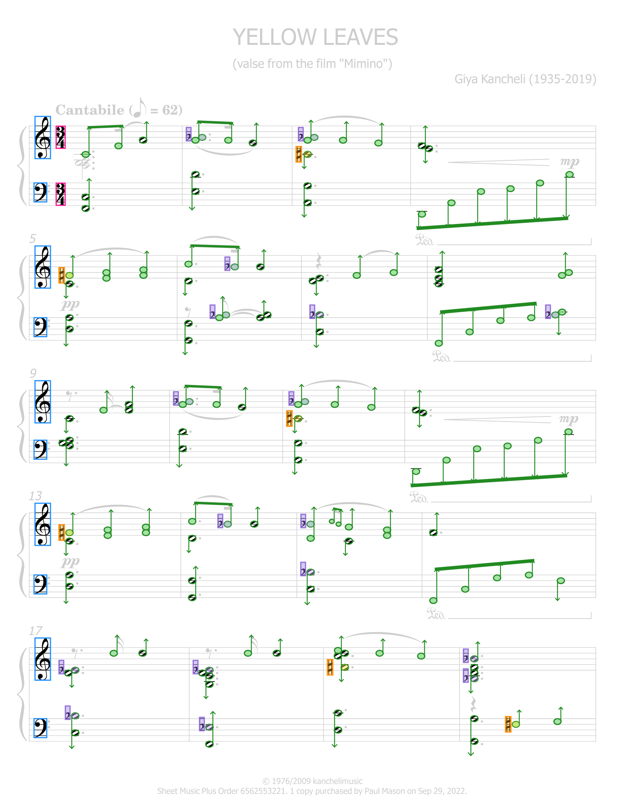
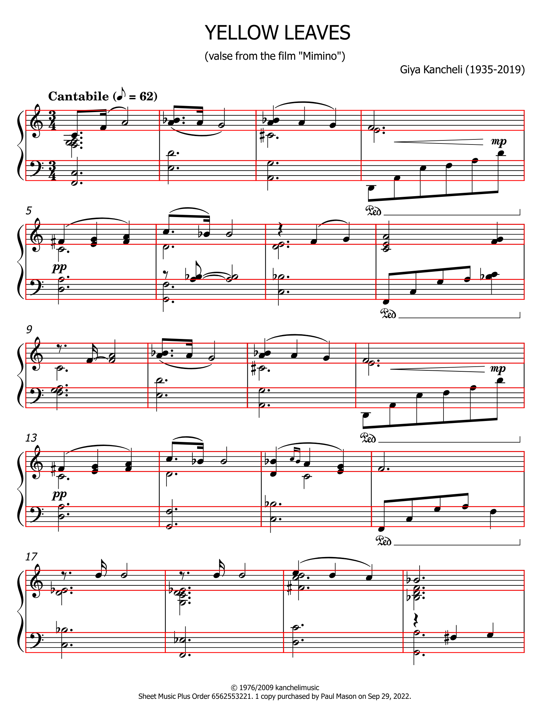
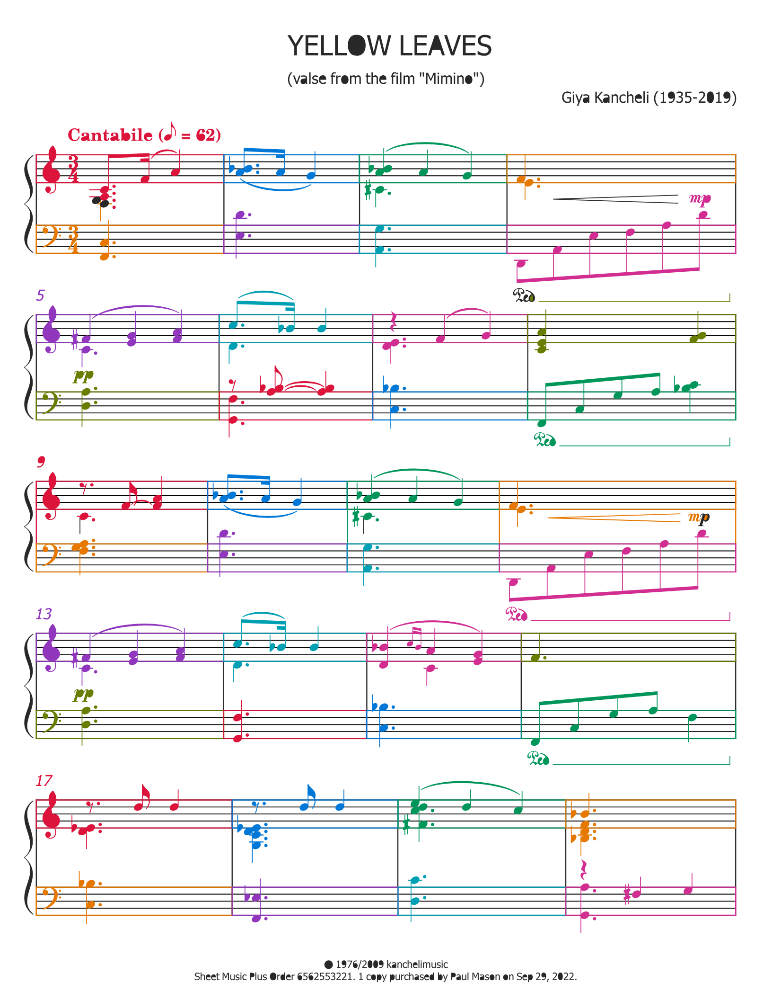
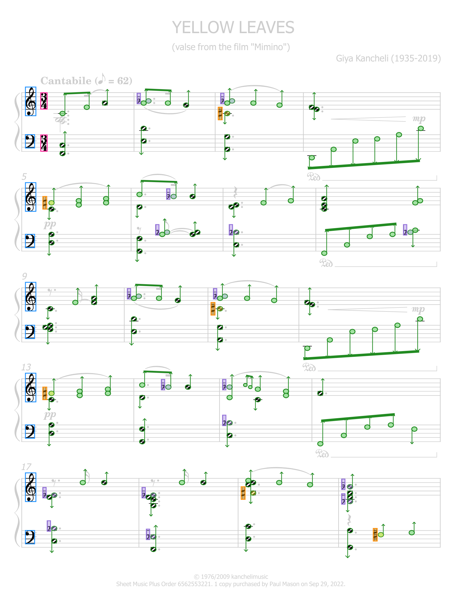

# SvgStructure step-by-step

Latest results: PartMeasureResolver → PrimitiveResolver → MusicSymbolResolver → MeterResolver → logical grid → ClefResolver → LedgerLineResolver.

| SVG | P+M blocks | Primitives | Music symbols | Semantic symbols | State |
|---|---|---|---|---|---|
| **[kancheli-accusation.svg](kancheli-accusation/source.svg)** [source tree](kancheli-accusation/source-tree.txt) [uses=565](kancheli-accusation/source-uses.json) |  |  [primitive SVG gallery](kancheli-accusation/primitives.html) (381) | [MusicSymbol gallery](kancheli-accusation/music-symbols.html) (893) |  meters=8 clefs=11 ledgerLadders=36 [meter inputs](kancheli-accusation/meter-inputs/index.html) [clef inputs](kancheli-accusation/clef-inputs/README.md) | sourceElements=1110 sourceUses=565 parts=2 measures=12 P+M=727 exported=381 M-only=321 physical=0 musicSymbols=893 [json](kancheli-accusation/structure.json) |
| **[kancheli-king-lear.svg](kancheli-king-lear/source.svg)** [source tree](kancheli-king-lear/source-tree.txt) [uses=381](kancheli-king-lear/source-uses.json) |  |  [primitive SVG gallery](kancheli-king-lear/primitives.html) (238) | [MusicSymbol gallery](kancheli-king-lear/music-symbols.html) (581) |  meters=2 clefs=6 ledgerLadders=20 [meter inputs](kancheli-king-lear/meter-inputs/index.html) [clef inputs](kancheli-king-lear/clef-inputs/README.md) | sourceElements=767 sourceUses=381 parts=2 measures=13 P+M=465 exported=238 M-only=243 physical=0 musicSymbols=581 [json](kancheli-king-lear/structure.json) |
| **[kancheli-mimino-1.svg](kancheli-mimino-1/source.svg)** [source tree](kancheli-mimino-1/source-tree.txt) [uses=441](kancheli-mimino-1/source-uses.json) |  |  [primitive SVG gallery](kancheli-mimino-1/primitives.html) (312) | [MusicSymbol gallery](kancheli-mimino-1/music-symbols.html) (691) |  meters=2 clefs=5 ledgerLadders=19 [meter inputs](kancheli-mimino-1/meter-inputs/index.html) [clef inputs](kancheli-mimino-1/clef-inputs/README.md) | sourceElements=870 sourceUses=441 parts=2 measures=20 P+M=630 exported=312 M-only=227 physical=0 musicSymbols=691 [json](kancheli-mimino-1/structure.json) |
| **[yellow-leaves-giya-kancheli-bravura-1.svg](yellow-leaves-giya-kancheli-bravura-1/source.svg)** [source tree](yellow-leaves-giya-kancheli-bravura-1/source-tree.txt) [uses=0](yellow-leaves-giya-kancheli-bravura-1/source-uses.json) |  |  [primitive SVG gallery](yellow-leaves-giya-kancheli-bravura-1/primitives.html) (654) | [MusicSymbol gallery](yellow-leaves-giya-kancheli-bravura-1/music-symbols.html) (715) |  meters=2 clefs=10 ledgerLadders=18 [meter inputs](yellow-leaves-giya-kancheli-bravura-1/meter-inputs/index.html) [clef inputs](yellow-leaves-giya-kancheli-bravura-1/clef-inputs/README.md) | sourceElements=589 sourceUses=0 parts=2 measures=20 P+M=654 exported=654 M-only=244 physical=0 musicSymbols=715 [json](yellow-leaves-giya-kancheli-bravura-1/structure.json) |
| **[yellow-leaves-giya-kancheli-ementaller-1.svg](yellow-leaves-giya-kancheli-ementaller-1/source.svg)** [source tree](yellow-leaves-giya-kancheli-ementaller-1/source-tree.txt) [uses=0](yellow-leaves-giya-kancheli-ementaller-1/source-uses.json) |  |  [primitive SVG gallery](yellow-leaves-giya-kancheli-ementaller-1/primitives.html) (652) | [MusicSymbol gallery](yellow-leaves-giya-kancheli-ementaller-1/music-symbols.html) (724) |  meters=2 clefs=10 ledgerLadders=18 [meter inputs](yellow-leaves-giya-kancheli-ementaller-1/meter-inputs/index.html) [clef inputs](yellow-leaves-giya-kancheli-ementaller-1/clef-inputs/README.md) | sourceElements=589 sourceUses=0 parts=2 measures=20 P+M=652 exported=652 M-only=248 physical=0 musicSymbols=724 [json](yellow-leaves-giya-kancheli-ementaller-1/structure.json) |
| **[yellow-leaves-giya-kancheli-finale-1.svg](yellow-leaves-giya-kancheli-finale-1/source.svg)** [source tree](yellow-leaves-giya-kancheli-finale-1/source-tree.txt) [uses=0](yellow-leaves-giya-kancheli-finale-1/source-uses.json) |  |  [primitive SVG gallery](yellow-leaves-giya-kancheli-finale-1/primitives.html) (644) | [MusicSymbol gallery](yellow-leaves-giya-kancheli-finale-1/music-symbols.html) (732) |  meters=2 clefs=10 ledgerLadders=18 [meter inputs](yellow-leaves-giya-kancheli-finale-1/meter-inputs/index.html) [clef inputs](yellow-leaves-giya-kancheli-finale-1/clef-inputs/README.md) | sourceElements=589 sourceUses=0 parts=2 measures=20 P+M=644 exported=644 M-only=252 physical=0 musicSymbols=732 [json](yellow-leaves-giya-kancheli-finale-1/structure.json) |
| **[yellow-leaves-giya-kancheli-gonville-1.svg](yellow-leaves-giya-kancheli-gonville-1/source.svg)** [source tree](yellow-leaves-giya-kancheli-gonville-1/source-tree.txt) [uses=0](yellow-leaves-giya-kancheli-gonville-1/source-uses.json) |  |  [primitive SVG gallery](yellow-leaves-giya-kancheli-gonville-1/primitives.html) (652) | [MusicSymbol gallery](yellow-leaves-giya-kancheli-gonville-1/music-symbols.html) (716) |  meters=2 clefs=10 ledgerLadders=18 [meter inputs](yellow-leaves-giya-kancheli-gonville-1/meter-inputs/index.html) [clef inputs](yellow-leaves-giya-kancheli-gonville-1/clef-inputs/README.md) | sourceElements=589 sourceUses=0 parts=2 measures=20 P+M=652 exported=652 M-only=248 physical=0 musicSymbols=716 [json](yellow-leaves-giya-kancheli-gonville-1/structure.json) |

A standalone browser report is also available as [index.html](index.html).
