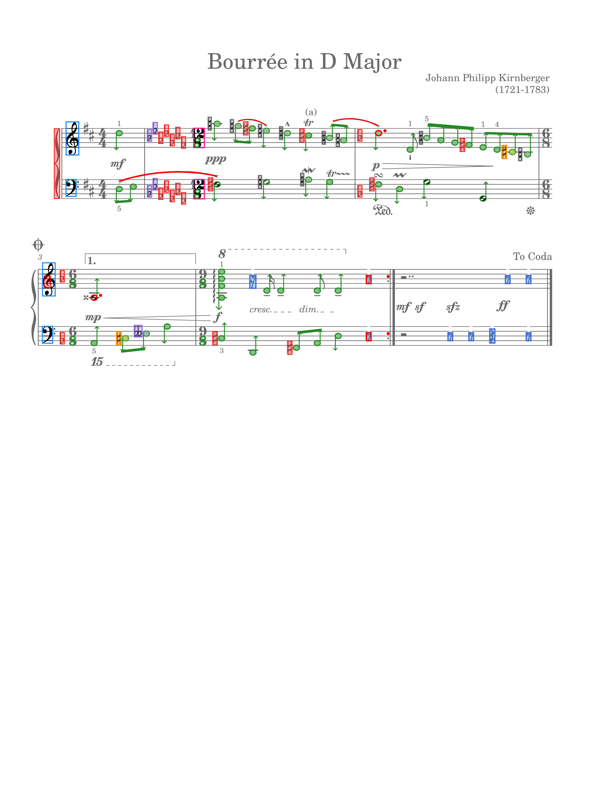
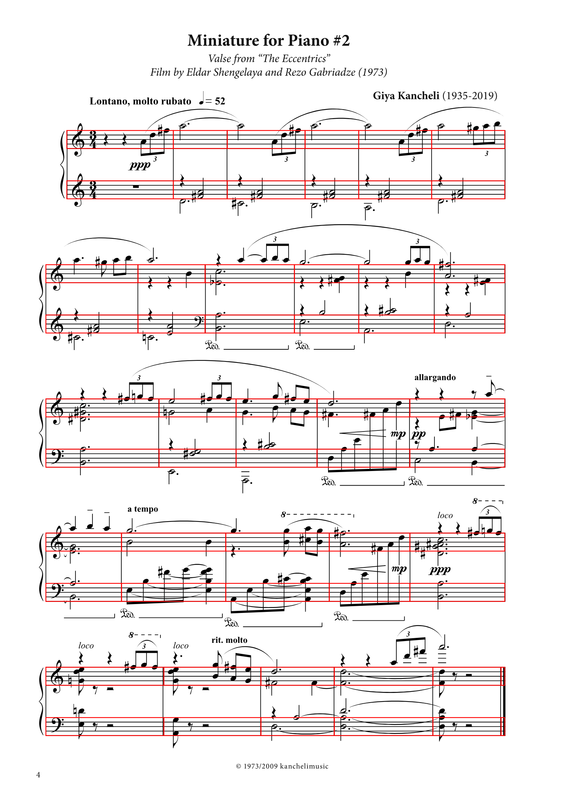
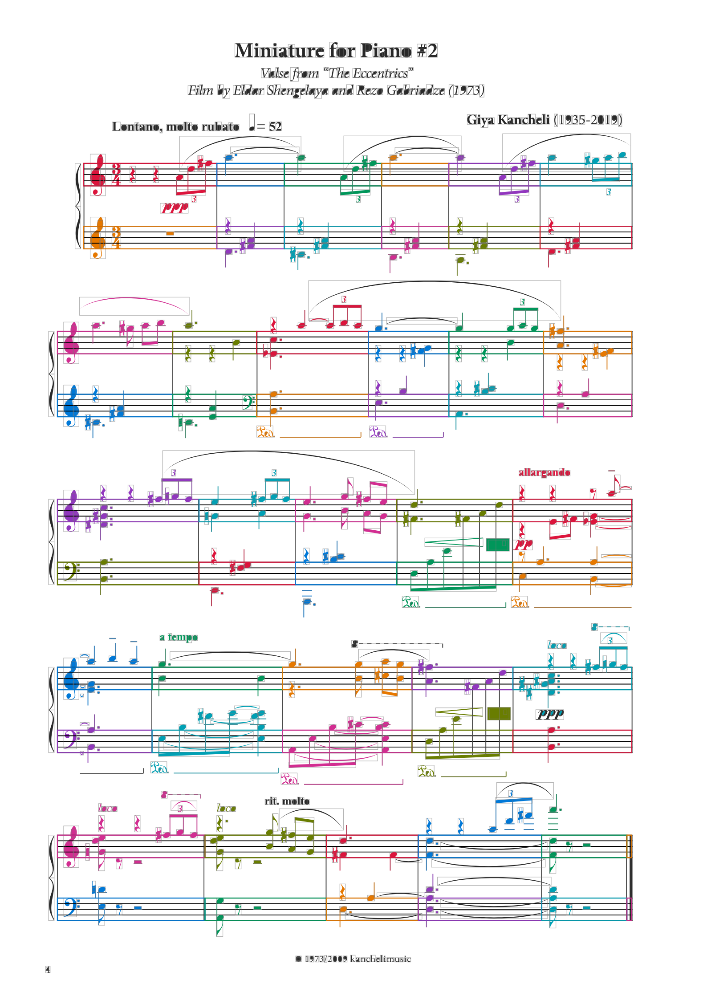
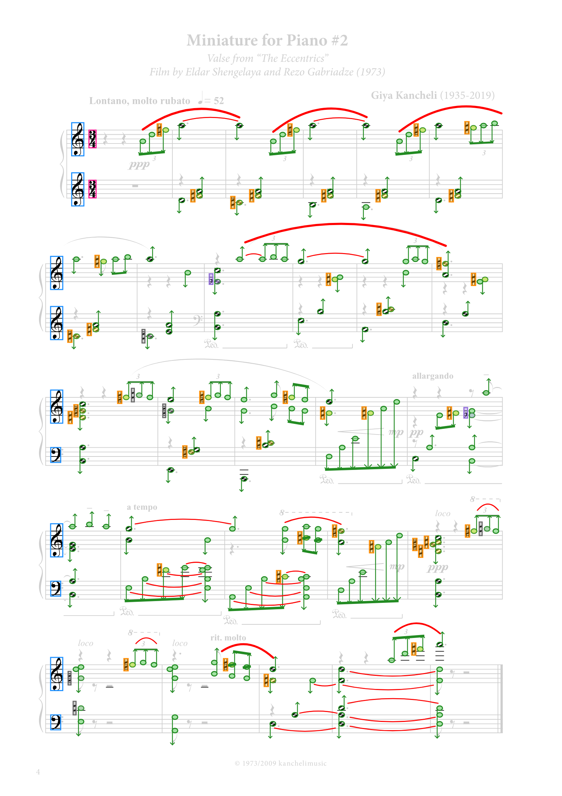
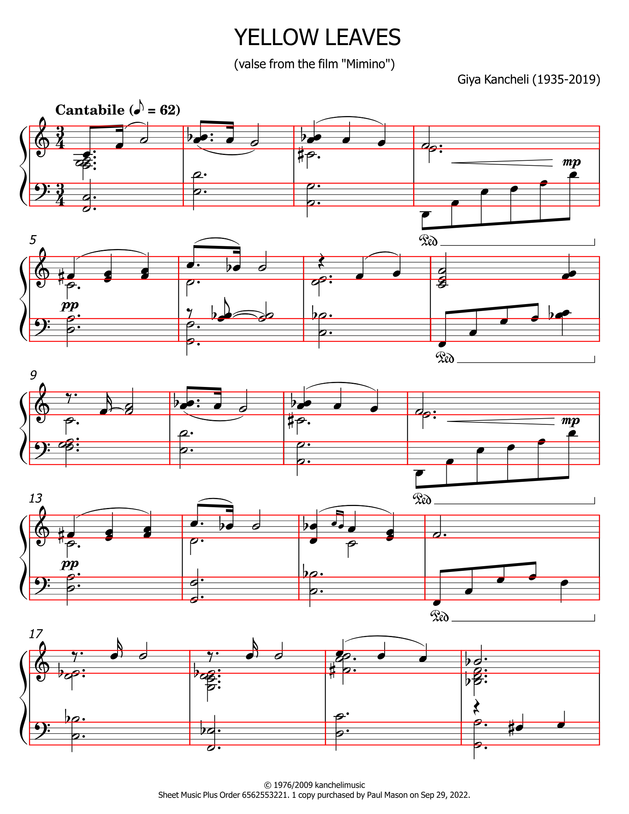
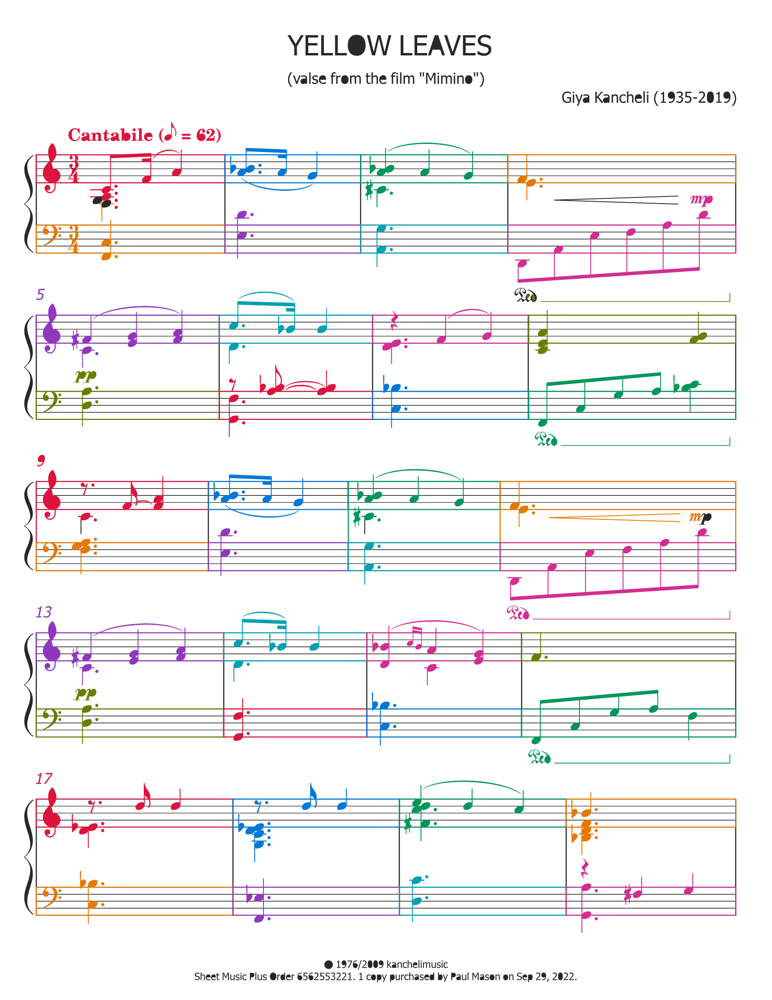
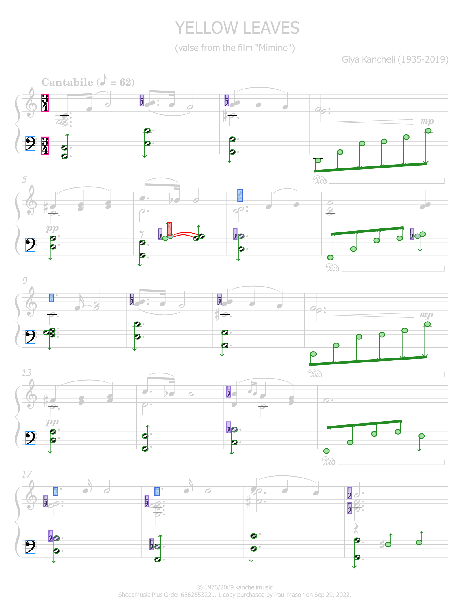

# SvgStructure step-by-step

**[Open the rendered HTML report on GitHub Pages](https://gasharva.github.io/svg-music/latest/step-by-step/)**

Latest results: PartMeasureResolver → PrimitiveResolver → MusicSymbolResolver → MeterResolver → logical grid → ClefResolver → LedgerLineResolver → NoteHeadResolver → AccidentalResolver.

| SVG | P+M blocks | Primitives | Music symbols | Semantic symbols | State |
|---|---|---|---|---|---|
| **[garbage-bravura.svg](https://gasharva.github.io/svg-music/latest/step-by-step/garbage-bravura/source.svg)** [source tree](https://gasharva.github.io/svg-music/latest/step-by-step/garbage-bravura/source-tree.txt) [uses=0](https://gasharva.github.io/svg-music/latest/step-by-step/garbage-bravura/source-uses.json) |  |  [primitive SVG gallery](https://gasharva.github.io/svg-music/latest/step-by-step/garbage-bravura/primitives.html) (339) | [MusicSymbol gallery](https://gasharva.github.io/svg-music/latest/step-by-step/garbage-bravura/music-symbols.html) (395) |  meters=2 clefs=4 ledgerLadders=6 noteHeads=59 accidentals=38 [meter inputs](https://gasharva.github.io/svg-music/latest/step-by-step/garbage-bravura/meter-inputs/) [clef inputs](https://gasharva.github.io/svg-music/latest/step-by-step/garbage-bravura/clef-inputs/) [note-head inputs](https://gasharva.github.io/svg-music/latest/step-by-step/garbage-bravura/notehead-inputs/) (65) | sourceElements=308 sourceUses=0 parts=2 measures=8 P+M=339 exported=339 M-only=153 physical=0 musicSymbols=395 [json](https://gasharva.github.io/svg-music/latest/step-by-step/garbage-bravura/structure.json) |
| **[kancheli-accusation.svg](https://gasharva.github.io/svg-music/latest/step-by-step/kancheli-accusation/source.svg)** [source tree](https://gasharva.github.io/svg-music/latest/step-by-step/kancheli-accusation/source-tree.txt) [uses=565](https://gasharva.github.io/svg-music/latest/step-by-step/kancheli-accusation/source-uses.json) |  |  [primitive SVG gallery](https://gasharva.github.io/svg-music/latest/step-by-step/kancheli-accusation/primitives.html) (382) | [MusicSymbol gallery](https://gasharva.github.io/svg-music/latest/step-by-step/kancheli-accusation/music-symbols.html) (893) |  meters=8 clefs=11 ledgerLadders=36 noteHeads=219 accidentals=15 [meter inputs](https://gasharva.github.io/svg-music/latest/step-by-step/kancheli-accusation/meter-inputs/) [clef inputs](https://gasharva.github.io/svg-music/latest/step-by-step/kancheli-accusation/clef-inputs/) [note-head inputs](https://gasharva.github.io/svg-music/latest/step-by-step/kancheli-accusation/notehead-inputs/) (257) | sourceElements=1110 sourceUses=565 parts=2 measures=12 P+M=729 exported=382 M-only=319 physical=0 musicSymbols=893 [json](https://gasharva.github.io/svg-music/latest/step-by-step/kancheli-accusation/structure.json) |
| **[kancheli-almonds.svg](https://gasharva.github.io/svg-music/latest/step-by-step/kancheli-almonds/source.svg)** [source tree](https://gasharva.github.io/svg-music/latest/step-by-step/kancheli-almonds/source-tree.txt) [uses=620](https://gasharva.github.io/svg-music/latest/step-by-step/kancheli-almonds/source-uses.json) |  |  [primitive SVG gallery](https://gasharva.github.io/svg-music/latest/step-by-step/kancheli-almonds/primitives.html) (445) | [MusicSymbol gallery](https://gasharva.github.io/svg-music/latest/step-by-step/kancheli-almonds/music-symbols.html) (1002) |  meters=2 clefs=10 ledgerLadders=35 noteHeads=254 accidentals=41 [meter inputs](https://gasharva.github.io/svg-music/latest/step-by-step/kancheli-almonds/meter-inputs/) [clef inputs](https://gasharva.github.io/svg-music/latest/step-by-step/kancheli-almonds/clef-inputs/) [note-head inputs](https://gasharva.github.io/svg-music/latest/step-by-step/kancheli-almonds/notehead-inputs/) (332) | sourceElements=1146 sourceUses=620 parts=2 measures=20 P+M=932 exported=445 M-only=257 physical=0 musicSymbols=1002 [json](https://gasharva.github.io/svg-music/latest/step-by-step/kancheli-almonds/structure.json) |
| **[kancheli-eccentrics.svg](https://gasharva.github.io/svg-music/latest/step-by-step/kancheli-eccentrics/source.svg)** [source tree](https://gasharva.github.io/svg-music/latest/step-by-step/kancheli-eccentrics/source-tree.txt) [uses=634](https://gasharva.github.io/svg-music/latest/step-by-step/kancheli-eccentrics/source-uses.json) |  |  [primitive SVG gallery](https://gasharva.github.io/svg-music/latest/step-by-step/kancheli-eccentrics/primitives.html) (490) | [MusicSymbol gallery](https://gasharva.github.io/svg-music/latest/step-by-step/kancheli-eccentrics/music-symbols.html) (1014) |  meters=2 clefs=10 ledgerLadders=46 noteHeads=204 accidentals=48 [meter inputs](https://gasharva.github.io/svg-music/latest/step-by-step/kancheli-eccentrics/meter-inputs/) [clef inputs](https://gasharva.github.io/svg-music/latest/step-by-step/kancheli-eccentrics/clef-inputs/) [note-head inputs](https://gasharva.github.io/svg-music/latest/step-by-step/kancheli-eccentrics/notehead-inputs/) (286) | sourceElements=1207 sourceUses=634 parts=2 measures=28 P+M=929 exported=490 M-only=313 physical=0 musicSymbols=1014 [json](https://gasharva.github.io/svg-music/latest/step-by-step/kancheli-eccentrics/structure.json) |
| **[kancheli-king-lear.svg](https://gasharva.github.io/svg-music/latest/step-by-step/kancheli-king-lear/source.svg)** [source tree](https://gasharva.github.io/svg-music/latest/step-by-step/kancheli-king-lear/source-tree.txt) [uses=381](https://gasharva.github.io/svg-music/latest/step-by-step/kancheli-king-lear/source-uses.json) |  |  [primitive SVG gallery](https://gasharva.github.io/svg-music/latest/step-by-step/kancheli-king-lear/primitives.html) (240) | [MusicSymbol gallery](https://gasharva.github.io/svg-music/latest/step-by-step/kancheli-king-lear/music-symbols.html) (582) |  meters=2 clefs=6 ledgerLadders=20 noteHeads=85 accidentals=34 [meter inputs](https://gasharva.github.io/svg-music/latest/step-by-step/kancheli-king-lear/meter-inputs/) [clef inputs](https://gasharva.github.io/svg-music/latest/step-by-step/kancheli-king-lear/clef-inputs/) [note-head inputs](https://gasharva.github.io/svg-music/latest/step-by-step/kancheli-king-lear/notehead-inputs/) (131) | sourceElements=767 sourceUses=381 parts=2 measures=13 P+M=466 exported=240 M-only=242 physical=0 musicSymbols=582 [json](https://gasharva.github.io/svg-music/latest/step-by-step/kancheli-king-lear/structure.json) |
| **[kancheli-mimino-1.svg](https://gasharva.github.io/svg-music/latest/step-by-step/kancheli-mimino-1/source.svg)** [source tree](https://gasharva.github.io/svg-music/latest/step-by-step/kancheli-mimino-1/source-tree.txt) [uses=441](https://gasharva.github.io/svg-music/latest/step-by-step/kancheli-mimino-1/source-uses.json) |  |  [primitive SVG gallery](https://gasharva.github.io/svg-music/latest/step-by-step/kancheli-mimino-1/primitives.html) (311) | [MusicSymbol gallery](https://gasharva.github.io/svg-music/latest/step-by-step/kancheli-mimino-1/music-symbols.html) (688) |  meters=2 clefs=10 ledgerLadders=19 noteHeads=152 accidentals=26 [meter inputs](https://gasharva.github.io/svg-music/latest/step-by-step/kancheli-mimino-1/meter-inputs/) [clef inputs](https://gasharva.github.io/svg-music/latest/step-by-step/kancheli-mimino-1/clef-inputs/) [note-head inputs](https://gasharva.github.io/svg-music/latest/step-by-step/kancheli-mimino-1/notehead-inputs/) (153) | sourceElements=870 sourceUses=441 parts=2 measures=20 P+M=632 exported=311 M-only=225 physical=0 musicSymbols=688 [json](https://gasharva.github.io/svg-music/latest/step-by-step/kancheli-mimino-1/structure.json) |
| **[yellow-leaves-giya-kancheli-ementaller-1.svg](https://gasharva.github.io/svg-music/latest/step-by-step/yellow-leaves-giya-kancheli-ementaller-1/source.svg)** [source tree](https://gasharva.github.io/svg-music/latest/step-by-step/yellow-leaves-giya-kancheli-ementaller-1/source-tree.txt) [uses=0](https://gasharva.github.io/svg-music/latest/step-by-step/yellow-leaves-giya-kancheli-ementaller-1/source-uses.json) |  |  [primitive SVG gallery](https://gasharva.github.io/svg-music/latest/step-by-step/yellow-leaves-giya-kancheli-ementaller-1/primitives.html) (653) | [MusicSymbol gallery](https://gasharva.github.io/svg-music/latest/step-by-step/yellow-leaves-giya-kancheli-ementaller-1/music-symbols.html) (722) |  meters=2 clefs=5 ledgerLadders=18 noteHeads=62 accidentals=15 [meter inputs](https://gasharva.github.io/svg-music/latest/step-by-step/yellow-leaves-giya-kancheli-ementaller-1/meter-inputs/) [clef inputs](https://gasharva.github.io/svg-music/latest/step-by-step/yellow-leaves-giya-kancheli-ementaller-1/clef-inputs/) [note-head inputs](https://gasharva.github.io/svg-music/latest/step-by-step/yellow-leaves-giya-kancheli-ementaller-1/notehead-inputs/) (235) | sourceElements=589 sourceUses=0 parts=2 measures=20 P+M=653 exported=653 M-only=247 physical=0 musicSymbols=722 [json](https://gasharva.github.io/svg-music/latest/step-by-step/yellow-leaves-giya-kancheli-ementaller-1/structure.json) |

Rendered browser report: [https://gasharva.github.io/svg-music/latest/step-by-step/](https://gasharva.github.io/svg-music/latest/step-by-step/)
