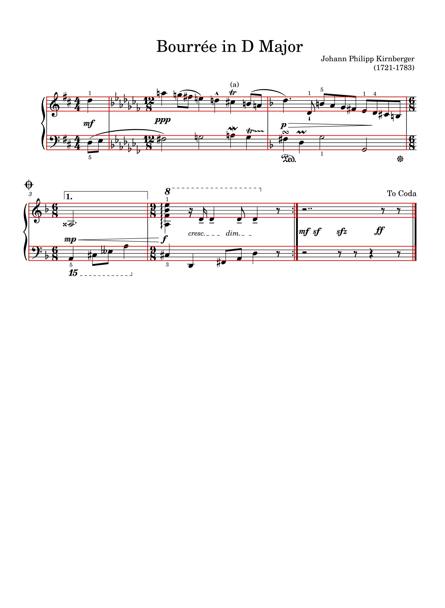
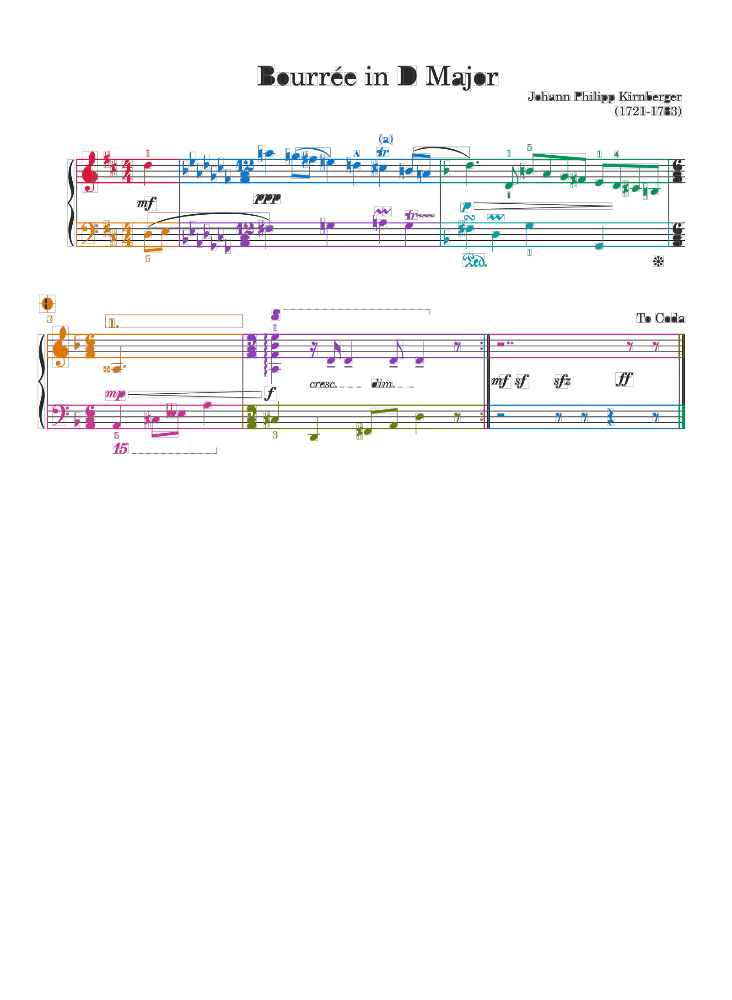
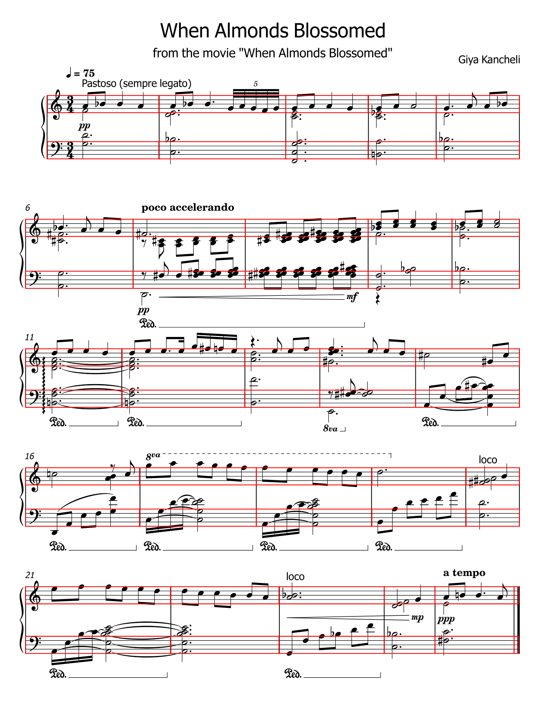
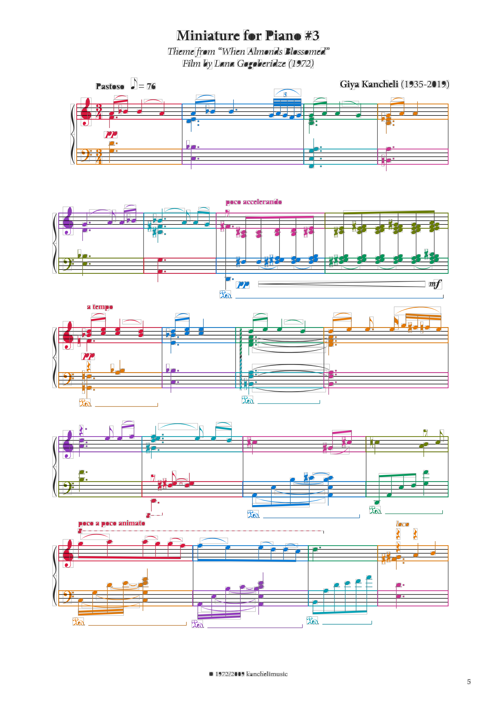
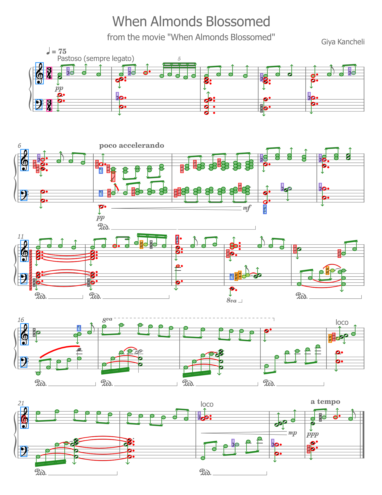
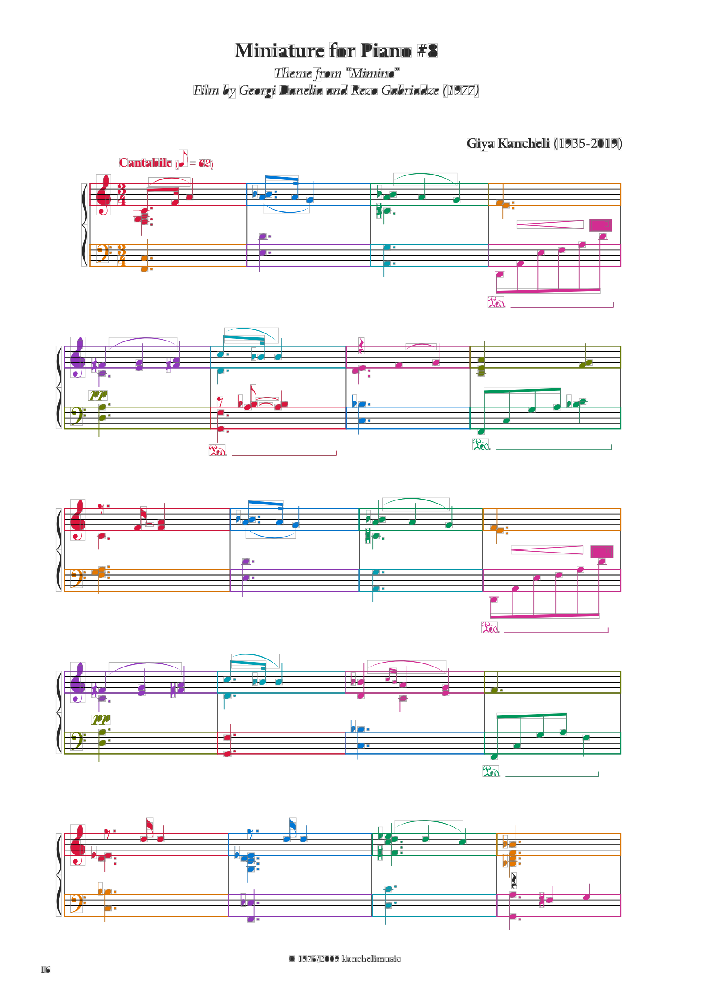
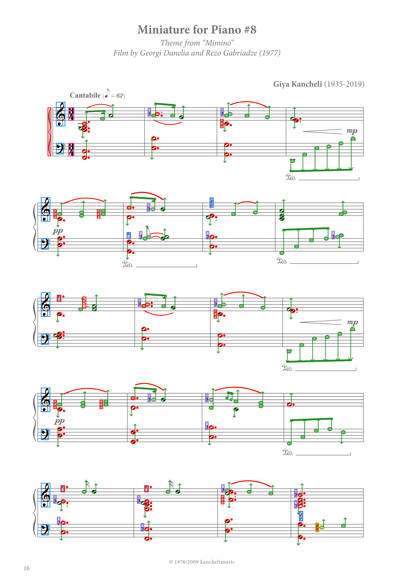

# SvgStructure diagnostics

**[Open the rendered HTML report on GitHub Pages](https://gasharva.github.io/svg-music/latest/step-by-step/)**

| SVG | P+M blocks | Primitives | Music symbols | Semantic symbols | State |
|---|---|---|---|---|---|
| **[garbage.svg](https://gasharva.github.io/svg-music/latest/step-by-step/garbage/source.svg)** |  |  [gallery](https://gasharva.github.io/svg-music/latest/step-by-step/garbage/primitives.html) | [MusicSymbol gallery](https://gasharva.github.io/svg-music/latest/step-by-step/garbage/music-symbols.html) (395) |  clefs=4 noteHeads=59 rests=9 | [json](https://gasharva.github.io/svg-music/latest/step-by-step/garbage/structure.json) |
| **[kancheli-accusation.svg](https://gasharva.github.io/svg-music/latest/step-by-step/kancheli-accusation/source.svg)** |  |  [gallery](https://gasharva.github.io/svg-music/latest/step-by-step/kancheli-accusation/primitives.html) | [MusicSymbol gallery](https://gasharva.github.io/svg-music/latest/step-by-step/kancheli-accusation/music-symbols.html) (893) |  clefs=11 noteHeads=219 rests=11 | [json](https://gasharva.github.io/svg-music/latest/step-by-step/kancheli-accusation/structure.json) |
| **[kancheli-almonds.svg](https://gasharva.github.io/svg-music/latest/step-by-step/kancheli-almonds/source.svg)** |  |  [gallery](https://gasharva.github.io/svg-music/latest/step-by-step/kancheli-almonds/primitives.html) | [MusicSymbol gallery](https://gasharva.github.io/svg-music/latest/step-by-step/kancheli-almonds/music-symbols.html) (1095) |  clefs=10 noteHeads=298 rests=6 | PartMeasureResolver - 50/50 (+2 extra) MeterResolver - 2/2 ClefResolver - 10/10 [reference checks](https://gasharva.github.io/svg-music/latest/step-by-step/kancheli-almonds/reference-checks.html) [resolved.musicxml](https://gasharva.github.io/svg-music/latest/step-by-step/kancheli-almonds/resolved.musicxml) [json](https://gasharva.github.io/svg-music/latest/step-by-step/kancheli-almonds/structure.json) |
| **[kancheli-mimino.svg](https://gasharva.github.io/svg-music/latest/step-by-step/kancheli-mimino/source.svg)** |  |  [gallery](https://gasharva.github.io/svg-music/latest/step-by-step/kancheli-mimino/primitives.html) | [MusicSymbol gallery](https://gasharva.github.io/svg-music/latest/step-by-step/kancheli-mimino/music-symbols.html) (688) |  clefs=10 noteHeads=152 rests=6 | PartMeasureResolver - 40/40 MeterResolver - 2/2 ClefResolver - 10/10 [reference checks](https://gasharva.github.io/svg-music/latest/step-by-step/kancheli-mimino/reference-checks.html) [resolved.musicxml](https://gasharva.github.io/svg-music/latest/step-by-step/kancheli-mimino/resolved.musicxml) [json](https://gasharva.github.io/svg-music/latest/step-by-step/kancheli-mimino/structure.json) |
