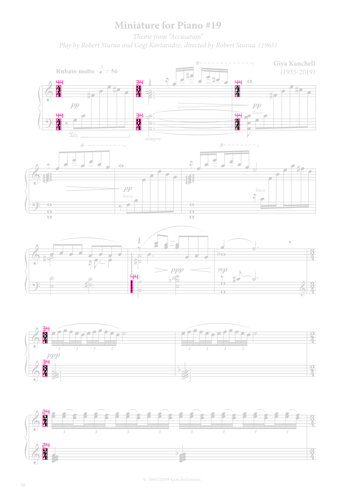
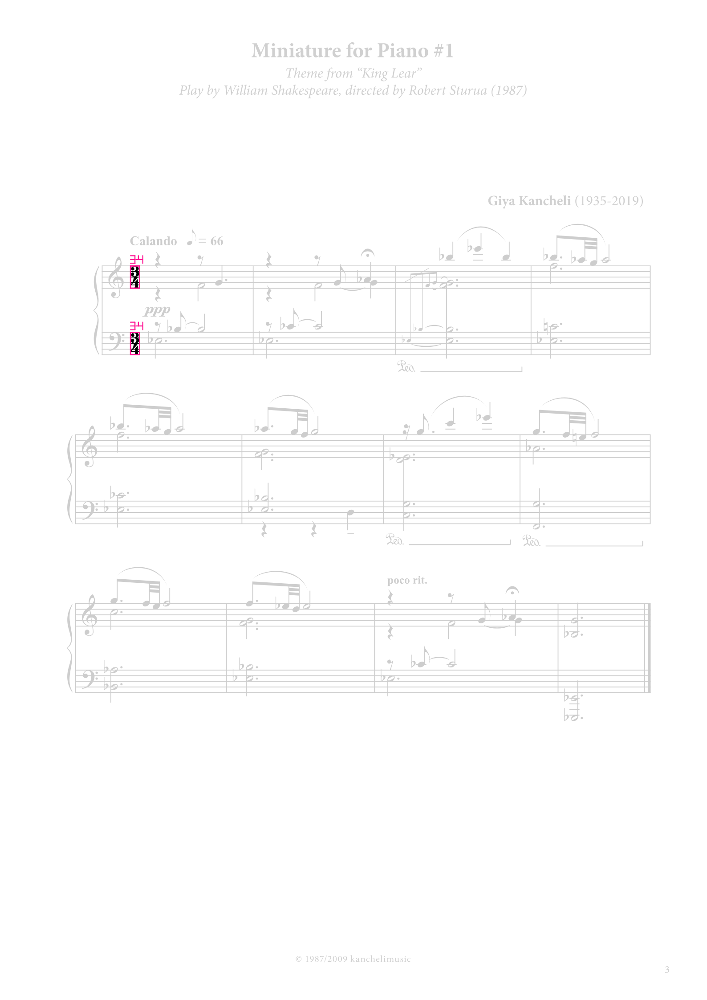

# SvgStructure step-by-step

Latest results produced by the CI pipeline: PartMeasureResolver → PrimitiveResolver → MeterResolver.

| SVG | P+M blocks | Primitives | Meters | State |
|---|---|---|---|---|
| **[kancheli-accusation.svg](kancheli-accusation/source.svg)** |  |  |  found=11 [recognizer inputs](kancheli-accusation/meter-inputs/index.html) | parts=2 measures=12 P+M=713 M-only=335 physical=0 [json](kancheli-accusation/structure.json) |
| **[kancheli-king-lear.svg](kancheli-king-lear/source.svg)** |  |  |  found=2 [recognizer inputs](kancheli-king-lear/meter-inputs/index.html) | parts=2 measures=13 P+M=458 M-only=250 physical=0 [json](kancheli-king-lear/structure.json) |
| **[kancheli-mimino-1.svg](kancheli-mimino-1/source.svg)** |  |  |  found=2 [recognizer inputs](kancheli-mimino-1/meter-inputs/index.html) | parts=2 measures=20 P+M=601 M-only=256 physical=0 [json](kancheli-mimino-1/structure.json) |

A standalone browser report is also available as [index.html](index.html).
