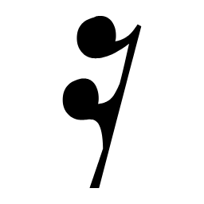
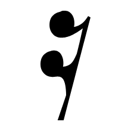
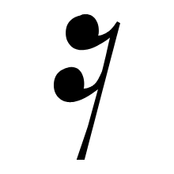
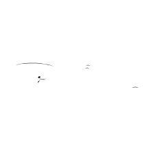
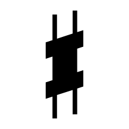

# Clef recognizer inputs

These are the exact post-sanity-filter vector candidates sent to `IClefRecognizer`.

`Legacy IoU` is the old shape-matching baseline: bbox-normalized 64x64 binary-mask IoU plus Clipper2 vector IoU. No size or staff-position prior is used.

`Skeleton` is the raw scanline-midpoint graph. `lines` traces that graph into chains and simplifies each chain with Ramer-Douglas-Peucker; no smoothing yet.

| Candidate | P+M | Logical bbox | Vector recognizer | Legacy IoU | Shape | Skeleton |
|---|---|---|---|---|---|---|
| [001](001.txt) | P1-M1 | `X 1.1..3.78, Y -3.27..11.5` | G 88.7 % | G 85.8 % |  | [raw](001.skeleton.svg) · [lines](001.skeleton-lines.svg) |
| [002](002.txt) | P2-M1 | `X 1.12..3.32, Y 0.01..6.66` | F 89.4 % | F 77.1 % |  | [raw](002.skeleton.svg) · [lines](002.skeleton-lines.svg) |
| [003](003.txt) | P1-M2 | `X 7.82..8.72, Y -5.69..0.07` | none (no result) | F 34.5 % |  | [raw](003.skeleton.svg) · [lines](003.skeleton-lines.svg) |
| [004](004.txt) | P2-M3 | `X 5.79..7.15, Y 6..13.65` | G 42.8 % | G 24.3 % |  | [raw](004.skeleton.svg) · [lines](004.skeleton-lines.svg) |
| [005](005.txt) | P1-M4 | `X 1.16..4, Y -3.27..11.5` | G 88.7 % | G 85.8 % |  | [raw](005.skeleton.svg) · [lines](005.skeleton-lines.svg) |
| [006](006.txt) | P2-M4 | `X 1.19..3.52, Y 0.01..6.66` | F 89.4 % | F 77.1 % |  | [raw](006.skeleton.svg) · [lines](006.skeleton-lines.svg) |
| [007](007.txt) | P1-M6 | `X 1.89..2.77, Y -5.69..0.07` | none (no result) | F 34.5 % |  | [raw](007.skeleton.svg) · [lines](007.skeleton-lines.svg) |
| [008](008.txt) | P2-M6 | `X 16.98..17.86, Y -5.7..0.07` | none (no result) | F 34.5 % |  | [raw](008.skeleton.svg) · [lines](008.skeleton-lines.svg) |
| [009](009.txt) | P1-M7 | `X 1.01..3.47, Y -3.27..11.5` | G 88.7 % | G 85.8 % |  | [raw](009.skeleton.svg) · [lines](009.skeleton-lines.svg) |
| [010](010.txt) | P1-M7 | `X 19.25..20.44, Y 8.3..14.07` | none (no result) | F 34.5 % |  | [raw](010.skeleton.svg) · [lines](010.skeleton-lines.svg) |
| [011](011.txt) | P1-M7 | `X 21.16..24.99, Y 7..14.64` | none (no result) | G 0.5 % |  | [raw](011.skeleton.svg) · [lines](011.skeleton-lines.svg) |
| [012](012.txt) | P2-M7 | `X 1.03..3.05, Y 0.01..6.66` | F 89.4 % | F 77.1 % |  | [raw](012.skeleton.svg) · [lines](012.skeleton-lines.svg) |
| [013](013.txt) | P2-M9 | `X 7.63..13.36, Y -8.64..-0.98` | none (no result) | F 0.4 % |  | [raw](013.skeleton.svg) · [lines](013.skeleton-lines.svg) |
| [014](014.txt) | P2-M9 | `X 29.58..31.57, Y -0.95..10.13` | G 90.3 % | G 87.0 % |  | [raw](014.skeleton.svg) · [lines](014.skeleton-lines.svg) |
| [015](015.txt) | P1-M10 | `X 0.51..1.76, Y -3.27..11.5` | G 88.7 % | G 85.8 % |  | [raw](015.skeleton.svg) · [lines](015.skeleton-lines.svg) |
| [016](016.txt) | P2-M10 | `X 0.51..1.76, Y -3.27..11.5` | G 88.7 % | G 85.8 % |  | [raw](016.skeleton.svg) · [lines](016.skeleton-lines.svg) |
| [017](017.txt) | P1-M12 | `X 0.27..0.93, Y -3.27..11.5` | G 88.7 % | G 85.8 % |  | [raw](017.skeleton.svg) · [lines](017.skeleton-lines.svg) |
| [018](018.txt) | P2-M12 | `X 0.27..0.93, Y -3.27..11.5` | G 88.7 % | G 85.8 % |  | [raw](018.skeleton.svg) · [lines](018.skeleton-lines.svg) |
| [019](019.txt) | P2-M12 | `X 1.97..2.55, Y 4..10.02` | none (no result) | G 34.5 % |  | [raw](019.skeleton.svg) · [lines](019.skeleton-lines.svg) |
| [020](020.txt) | P2-M12 | `X 12.98..13.56, Y 4..10.02` | none (no result) | G 34.5 % |  | [raw](020.skeleton.svg) · [lines](020.skeleton-lines.svg) |
