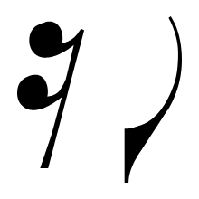
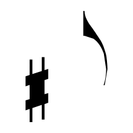

# Clef recognizer inputs

These are the exact post-sanity-filter vector candidates sent to `IClefRecognizer`.

| Candidate | P+M | Logical bbox | Recognizer | Shape |
|---|---|---|---|---|
| [001](001.txt) | P1-M1 | `X 1.1..3.78, Y -3.27..11.5` | F 5.5 % |  |
| [002](002.txt) | P1-M1 | `X 1.1..3.78, Y -3.27..11.5` | F 5.5 % |  |
| [003](003.txt) | P1-M1 | `X 1.34..2.88, Y 2.44..7.84` | F 5.5 % |  |
| [004](004.txt) | P1-M1 | `X 15.93..16.87, Y 4.25..9.71` | F 5.5 % |  |
| [005](005.txt) | P1-M1 | `X 24.92..25.86, Y 0.25..5.71` | F 5.5 % |  |
| [006](006.txt) | P2-M1 | `X 1.12..3.32, Y 0.01..6.66` | F 5.5 % |  |
| [007](007.txt) | P1-M2 | `X 3.74..4.42, Y -5.02..0.86` | F 5.5 % |  |
| [008](008.txt) | P1-M2 | `X 7.82..8.72, Y -5.69..0.07` | F 5.5 % |  |
| [009](009.txt) | P1-M2 | `X 12.9..13.55, Y -9.75..-4.29` | F 5.5 % |  |
| [010](010.txt) | P1-M2 | `X 19.22..19.87, Y -6.75..-1.29` | F 5.5 % |  |
| [011](011.txt) | P1-M3 | `X 14.39..15.41, Y 4.25..9.71` | F 5.5 % |  |
| [012](012.txt) | P1-M3 | `X 24.19..25.22, Y 0.25..5.71` | F 5.5 % |  |
| [013](013.txt) | P2-M3 | `X 5.79..7, Y 7.1..13.65` | F 5.5 % |  |
| [014](014.txt) | P1-M4 | `X 1.16..4.01, Y -3.27..11.5` | F 5.5 % |  |
| [015](015.txt) | P1-M4 | `X 1.16..4.01, Y -3.27..11.5` | F 5.5 % |  |
| [016](016.txt) | P1-M4 | `X 1.42..3.05, Y 2.44..7.83` | F 5.5 % |  |
| [017](017.txt) | P2-M4 | `X 1.19..3.52, Y 0.01..6.66` | F 5.5 % |  |
| [018](018.txt) | P1-M6 | `X 1.92..2.8, Y -5.69..0.07` | F 5.5 % |  |
| [019](019.txt) | P1-M6 | `X 27.55..28.19, Y -2.75..2.71` | F 5.5 % |  |
| [020](020.txt) | P2-M6 | `X 16.99..17.87, Y -5.7..0.07` | F 5.5 % |  |
| [021](021.txt) | P1-M7 | `X 1.01..3.48, Y -3.27..11.5` | F 5.5 % |  |
| [022](022.txt) | P1-M7 | `X 1.01..3.48, Y -3.27..11.5` | F 5.5 % |  |
| [023](023.txt) | P1-M7 | `X 1.23..2.65, Y 2.44..7.83` | F 5.5 % |  |
| [024](024.txt) | P1-M7 | `X 4.56..5.43, Y 4.25..9.71` | F 5.5 % |  |
| [025](025.txt) | P1-M7 | `X 19.27..20.47, Y 8.3..14.07` | F 5.5 % |  |
| [026](026.txt) | P1-M7 | `X 19.27..22.22, Y 8.1..14.64` | F 5.5 % |  |
| [027](027.txt) | P1-M7 | `X 21.2..22.22, Y 8.1..14.64` | F 5.5 % |  |
| [028](028.txt) | P2-M7 | `X 1.03..3.06, Y 0.01..6.66` | F 5.5 % |  |
| [029](029.txt) | P2-M7 | `X 18.12..18.98, Y -0.75..4.71` | F 5.5 % |  |
| [030](030.txt) | P1-M8 | `X 2.35..3.34, Y 6.25..11.71` | F 5.5 % |  |
| [031](031.txt) | P1-M8 | `X 3.75..4.78, Y -9.02..-3.14` | F 5.5 % |  |
| [032](032.txt) | P2-M9 | `X 6.38..7.3, Y -4.75..0.71` | F 5.5 % |  |
| [033](033.txt) | P2-M9 | `X 6.38..9.72, Y -8.64..0.71` | F 5.5 % |  |
| [034](034.txt) | P2-M9 | `X 8.74..9.72, Y -8.64..-2.39` | F 5.5 % |  |
| [035](035.txt) | P2-M9 | `X 29.55..31.52, Y -0.95..10.13` | F 5.5 % |  |
| [036](036.txt) | P1-M10 | `X 0.51..1.76, Y -3.27..11.5` | F 5.5 % |  |
| [037](037.txt) | P1-M10 | `X 0.51..1.76, Y -3.27..11.5` | F 5.5 % |  |
| [038](038.txt) | P1-M10 | `X 0.62..1.34, Y 2.44..7.83` | F 5.5 % |  |
| [039](039.txt) | P2-M10 | `X 0.51..1.76, Y -3.27..11.5` | F 5.5 % |  |
| [040](040.txt) | P2-M10 | `X 0.51..1.76, Y -3.27..11.5` | F 5.5 % |  |
| [041](041.txt) | P2-M10 | `X 0.62..1.34, Y 2.44..7.83` | F 5.5 % |  |
| [042](042.txt) | P1-M12 | `X 0.18..0.62, Y -3.27..11.5` | F 5.5 % |  |
| [043](043.txt) | P1-M12 | `X 0.18..0.62, Y -3.27..11.5` | F 5.5 % |  |
| [044](044.txt) | P1-M12 | `X 0.22..0.47, Y 2.44..7.83` | F 5.5 % |  |
| [045](045.txt) | P2-M12 | `X 0.18..0.62, Y -3.27..11.5` | F 5.5 % |  |
| [046](046.txt) | P2-M12 | `X 0.18..0.62, Y -3.27..11.5` | F 5.5 % |  |
| [047](047.txt) | P2-M12 | `X 0.22..0.47, Y 2.44..7.83` | F 5.5 % |  |
