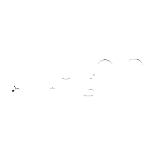

# Clef recognizer inputs

These are the exact post-sanity-filter vector candidates sent to `IClefRecognizer`.

`Raster` is an independent 48x48 grayscale baseline: references are rasterized once and cached in memory.

| Candidate | P+M | Logical bbox | Vector recognizer | Raster | Shape |
|---|---|---|---|---|---|
| [001](001.txt) | P1-M1 | `X 0.99..3.42, Y -3.27..11.5` | none (Open-set rejection: nearest/ref=0.918 (max 0.72), margin/ref=0.541 (min 0.2).) | G 22.5 % |  |
| [002](002.txt) | P2-M1 | `X 1.01..3.01, Y 0.01..6.66` | none (Open-set rejection: nearest/ref=0.918 (max 0.72), margin/ref=0.541 (min 0.2).) | G 13.7 % |  |
| [003](003.txt) | P1-M5 | `X 0.9..3.11, Y -3.27..11.5` | none (Open-set rejection: nearest/ref=0.918 (max 0.72), margin/ref=0.541 (min 0.2).) | G 22.5 % |  |
| [004](004.txt) | P2-M5 | `X 0.92..2.73, Y 0.01..6.66` | none (Open-set rejection: nearest/ref=0.918 (max 0.72), margin/ref=0.541 (min 0.2).) | G 13.7 % |  |
| [005](005.txt) | P1-M7 | `X 3.38..4.68, Y -3.69..2.07` | none (Open-set rejection: nearest/ref=0.918 (max 0.72), margin/ref=0.541 (min 0.2).) | G 39.1 % |  |
| [006](006.txt) | P1-M9 | `X 0.99..3.42, Y -3.27..11.5` | none (Open-set rejection: nearest/ref=0.918 (max 0.72), margin/ref=0.541 (min 0.2).) | G 22.5 % |  |
| [007](007.txt) | P2-M9 | `X 1.02..3.01, Y 0.01..6.66` | none (Open-set rejection: nearest/ref=0.918 (max 0.72), margin/ref=0.541 (min 0.2).) | G 13.7 % |  |
