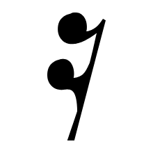

# Clef recognizer inputs

These are the exact post-sanity-filter vector candidates sent to `IClefRecognizer`.

`Legacy IoU` is the old shape-matching baseline: bbox-normalized 64x64 binary-mask IoU plus Clipper2 vector IoU. No size or staff-position prior is used.

`Skeleton` is the raw scanline-midpoint graph. `lines` traces that graph into chains and simplifies each chain with Ramer-Douglas-Peucker; no smoothing yet.

| Candidate | P+M | Logical bbox | Vector recognizer | Legacy IoU | Shape | Skeleton |
|---|---|---|---|---|---|---|
| [001](001.txt) | P1-M1 | `X ?..?, Y -3.27..11.5` | none (Open-set rejection: nearest/ref=0.918 (max 0.72), margin/ref=0.541 (min 0.2).) | G 85.8 % |  | [raw](001.skeleton.svg) · [lines](001.skeleton-lines.svg) |
| [002](002.txt) | P2-M1 | `X ?..?, Y 0.01..6.66` | none (Open-set rejection: nearest/ref=0.918 (max 0.72), margin/ref=0.541 (min 0.2).) | F 77.1 % |  | [raw](002.skeleton.svg) · [lines](002.skeleton-lines.svg) |
| [003](003.txt) | P2-M1 | `X ?..?, Y -7.64..0.02` | none (Open-set rejection: nearest/ref=0.918 (max 0.72), margin/ref=0.541 (min 0.2).) | F 0.8 % |  | [raw](003.skeleton.svg) · [lines](003.skeleton-lines.svg) |
| [004](004.txt) | P2-M1 | `X ?..?, Y -7.64..-1.39` | none (Open-set rejection: nearest/ref=0.918 (max 0.72), margin/ref=0.541 (min 0.2).) | F 0.6 % |  | [raw](004.skeleton.svg) · [lines](004.skeleton-lines.svg) |
| [005](005.txt) | P1-M2 | `X ?..?, Y -0.64..7.02` | none (Open-set rejection: nearest/ref=0.918 (max 0.72), margin/ref=0.541 (min 0.2).) | G 19.3 % |  | [raw](005.skeleton.svg) · [lines](005.skeleton-lines.svg) |
| [006](006.txt) | P1-M5 | `X ?..?, Y -3.27..11.5` | none (Open-set rejection: nearest/ref=0.918 (max 0.72), margin/ref=0.541 (min 0.2).) | G 85.8 % |  | [raw](006.skeleton.svg) · [lines](006.skeleton-lines.svg) |
| [007](007.txt) | P2-M5 | `X ?..?, Y 0.01..6.66` | none (Open-set rejection: nearest/ref=0.918 (max 0.72), margin/ref=0.541 (min 0.2).) | F 77.1 % |  | [raw](007.skeleton.svg) · [lines](007.skeleton-lines.svg) |
| [008](008.txt) | P1-M7 | `X ?..?, Y -3.69..2.07` | none (Open-set rejection: nearest/ref=0.918 (max 0.72), margin/ref=0.541 (min 0.2).) | F 34.5 % |  | [raw](008.skeleton.svg) · [lines](008.skeleton-lines.svg) |
| [009](009.txt) | P1-M7 | `X ?..?, Y -7.63..0.02` | none (Open-set rejection: nearest/ref=0.918 (max 0.72), margin/ref=0.541 (min 0.2).) | G 19.3 % |  | [raw](009.skeleton.svg) · [lines](009.skeleton-lines.svg) |
| [010](010.txt) | P1-M9 | `X ?..?, Y -3.27..11.5` | none (Open-set rejection: nearest/ref=0.918 (max 0.72), margin/ref=0.541 (min 0.2).) | G 85.8 % |  | [raw](010.skeleton.svg) · [lines](010.skeleton-lines.svg) |
| [011](011.txt) | P2-M9 | `X ?..?, Y 0.01..6.66` | none (Open-set rejection: nearest/ref=0.918 (max 0.72), margin/ref=0.541 (min 0.2).) | F 77.1 % |  | [raw](011.skeleton.svg) · [lines](011.skeleton-lines.svg) |
| [012](012.txt) | P1-M11 | `X ?..?, Y -0.64..7.02` | none (Open-set rejection: nearest/ref=0.918 (max 0.72), margin/ref=0.541 (min 0.2).) | G 19.5 % |  | [raw](012.skeleton.svg) · [lines](012.skeleton-lines.svg) |
