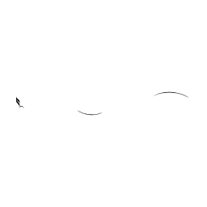

# Clef recognizer inputs

These are the exact post-sanity-filter vector candidates sent to `IClefRecognizer`.

`Legacy IoU` is the old shape-matching baseline: bbox-normalized 64x64 binary-mask IoU plus Clipper2 vector IoU. No size or staff-position prior is used.

`Skeleton` is the raw scanline-midpoint graph. `lines` traces that graph into chains and simplifies each chain with Ramer-Douglas-Peucker; no smoothing yet.

| Candidate | P+M | Logical bbox | Vector recognizer | Legacy IoU | Shape | Skeleton |
|---|---|---|---|---|---|---|
| [001](001.txt) | P1-M1 | `X 0.91..3.2, Y -3.36..11.53` | none (Open-set rejection: nearest/ref=0.918 (max 0.72), margin/ref=0.541 (min 0.2).) | G 77.6 % |  | [raw](001.skeleton.svg) · [lines](001.skeleton-lines.svg) |
| [002](002.txt) | P2-M1 | `X 0.93..2.81, Y 0.01..6.69` | none (Open-set rejection: nearest/ref=0.918 (max 0.72), margin/ref=0.541 (min 0.2).) | F 77.9 % |  | [raw](002.skeleton.svg) · [lines](002.skeleton-lines.svg) |
| [003](003.txt) | P1-M5 | `X 0.98..3.42, Y -3.36..11.53` | none (Open-set rejection: nearest/ref=0.918 (max 0.72), margin/ref=0.541 (min 0.2).) | G 77.6 % |  | [raw](003.skeleton.svg) · [lines](003.skeleton-lines.svg) |
| [004](004.txt) | P2-M5 | `X 1..3, Y 0.01..6.69` | none (Open-set rejection: nearest/ref=0.918 (max 0.72), margin/ref=0.541 (min 0.2).) | F 77.9 % |  | [raw](004.skeleton.svg) · [lines](004.skeleton-lines.svg) |
| [005](005.txt) | P2-M6 | `X 7.03..12.02, Y -8.29..0.06` | none (Open-set rejection: nearest/ref=0.918 (max 0.72), margin/ref=0.541 (min 0.2).) | F 1.3 % |  | [raw](005.skeleton.svg) · [lines](005.skeleton-lines.svg) |
| [006](006.txt) | P1-M9 | `X 0.86..3.02, Y -3.36..11.52` | none (Open-set rejection: nearest/ref=0.918 (max 0.72), margin/ref=0.541 (min 0.2).) | G 77.6 % |  | [raw](006.skeleton.svg) · [lines](006.skeleton-lines.svg) |
| [007](007.txt) | P1-M9 | `X 10.11..12.98, Y -0.78..8.06` | none (Open-set rejection: nearest/ref=0.918 (max 0.72), margin/ref=0.541 (min 0.2).) | F 1.1 % |  | [raw](007.skeleton.svg) · [lines](007.skeleton-lines.svg) |
| [008](008.txt) | P1-M9 | `X 11.01..12.98, Y -0.78..6.53` | none (Open-set rejection: nearest/ref=0.918 (max 0.72), margin/ref=0.541 (min 0.2).) | F 0.9 % |  | [raw](008.skeleton.svg) · [lines](008.skeleton-lines.svg) |
| [009](009.txt) | P2-M9 | `X 0.88..2.65, Y 0..6.69` | none (Open-set rejection: nearest/ref=0.918 (max 0.72), margin/ref=0.541 (min 0.2).) | F 77.9 % |  | [raw](009.skeleton.svg) · [lines](009.skeleton-lines.svg) |
| [010](010.txt) | P1-M13 | `X 0.93..3.27, Y -3.36..11.52` | none (Open-set rejection: nearest/ref=0.918 (max 0.72), margin/ref=0.541 (min 0.2).) | G 77.6 % |  | [raw](010.skeleton.svg) · [lines](010.skeleton-lines.svg) |
| [011](011.txt) | P2-M13 | `X 0.95..2.86, Y 0..6.69` | none (Open-set rejection: nearest/ref=0.918 (max 0.72), margin/ref=0.541 (min 0.2).) | F 77.9 % |  | [raw](011.skeleton.svg) · [lines](011.skeleton-lines.svg) |
| [012](012.txt) | P1-M17 | `X 0.87..3.05, Y -3.36..11.52` | none (Open-set rejection: nearest/ref=0.918 (max 0.72), margin/ref=0.541 (min 0.2).) | G 77.6 % |  | [raw](012.skeleton.svg) · [lines](012.skeleton-lines.svg) |
| [013](013.txt) | P1-M17 | `X 11.12..12.96, Y -5.79..3.06` | none (Open-set rejection: nearest/ref=0.918 (max 0.72), margin/ref=0.541 (min 0.2).) | F 23.5 % |  | [raw](013.skeleton.svg) · [lines](013.skeleton-lines.svg) |
| [014](014.txt) | P1-M17 | `X 12.02..12.96, Y -5.79..1.35` | none (Open-set rejection: nearest/ref=0.918 (max 0.72), margin/ref=0.541 (min 0.2).) | F 29.9 % |  | [raw](014.skeleton.svg) · [lines](014.skeleton-lines.svg) |
| [015](015.txt) | P2-M17 | `X 0.89..2.67, Y 0..6.69` | none (Open-set rejection: nearest/ref=0.918 (max 0.72), margin/ref=0.541 (min 0.2).) | F 77.9 % |  | [raw](015.skeleton.svg) · [lines](015.skeleton-lines.svg) |
| [016](016.txt) | P1-M18 | `X 9.18..11.28, Y -5.79..3.06` | none (Open-set rejection: nearest/ref=0.918 (max 0.72), margin/ref=0.541 (min 0.2).) | F 23.5 % |  | [raw](016.skeleton.svg) · [lines](016.skeleton-lines.svg) |
| [017](017.txt) | P1-M18 | `X 10.2..11.28, Y -5.79..1.35` | none (Open-set rejection: nearest/ref=0.918 (max 0.72), margin/ref=0.541 (min 0.2).) | F 29.9 % |  | [raw](017.skeleton.svg) · [lines](017.skeleton-lines.svg) |
