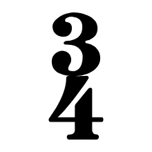

# Clef recognizer inputs

These are the exact post-sanity-filter vector candidates sent to `IClefRecognizer`.

`Legacy IoU` is the old shape-matching baseline: bbox-normalized 64x64 binary-mask IoU plus Clipper2 vector IoU. No size or staff-position prior is used.

`Skeleton` is the raw scanline-midpoint graph. `lines` traces that graph into chains and simplifies each chain with Ramer-Douglas-Peucker; no smoothing yet.

| Candidate | P+M | Logical bbox | Vector recognizer | Legacy IoU | Shape | Skeleton |
|---|---|---|---|---|---|---|
| [001](001.txt) | P1-M1 | `X 0.8..3.18, Y -2.79..11.26` | G 98.4 % | G 99.8 % |  | [raw](001.skeleton.svg) · [lines](001.skeleton-lines.svg) |
| [002](002.txt) | P1-M1 | `X 4.11..5.64, Y 0..8` | none (no result) | G 39.2 % |  | [raw](002.skeleton.svg) · [lines](002.skeleton-lines.svg) |
| [003](003.txt) | P2-M1 | `X 0.78..2.68, Y -0.1..7.08` | F 98.4 % | F 99.8 % |  | [raw](003.skeleton.svg) · [lines](003.skeleton-lines.svg) |
| [004](004.txt) | P2-M1 | `X 4.11..5.64, Y -0..8` | none (no result) | G 39.2 % |  | [raw](004.skeleton.svg) · [lines](004.skeleton-lines.svg) |
| [005](005.txt) | P1-M5 | `X 0.83..3.31, Y -2.79..11.26` | G 98.4 % | G 99.8 % |  | [raw](005.skeleton.svg) · [lines](005.skeleton-lines.svg) |
| [006](006.txt) | P2-M5 | `X 0.81..2.79, Y -0.1..7.08` | F 98.4 % | F 99.8 % |  | [raw](006.skeleton.svg) · [lines](006.skeleton-lines.svg) |
| [007](007.txt) | P2-M6 | `X 7.49..10.23, Y -7.57..1.12` | none (no result) | F 26.8 % |  | [raw](007.skeleton.svg) · [lines](007.skeleton-lines.svg) |
| [008](008.txt) | P1-M9 | `X 0.88..3.5, Y -2.79..11.26` | G 98.4 % | G 99.8 % |  | [raw](008.skeleton.svg) · [lines](008.skeleton-lines.svg) |
| [009](009.txt) | P1-M9 | `X 12.01..16.18, Y -0.02..8.12` | none (no result) | F 16.4 % |  | [raw](009.skeleton.svg) · [lines](009.skeleton-lines.svg) |
| [010](010.txt) | P1-M9 | `X 13.18..16.18, Y -0.02..6.6` | none (no result) | F 15.0 % |  | [raw](010.skeleton.svg) · [lines](010.skeleton-lines.svg) |
| [011](011.txt) | P2-M9 | `X 0.86..2.95, Y -0.1..7.08` | F 98.4 % | F 99.8 % |  | [raw](011.skeleton.svg) · [lines](011.skeleton-lines.svg) |
| [012](012.txt) | P1-M13 | `X 0.81..3.22, Y -2.79..11.26` | G 98.4 % | G 99.8 % |  | [raw](012.skeleton.svg) · [lines](012.skeleton-lines.svg) |
| [013](013.txt) | P2-M13 | `X 0.79..2.72, Y -0.1..7.08` | F 98.4 % | F 99.8 % |  | [raw](013.skeleton.svg) · [lines](013.skeleton-lines.svg) |
| [014](014.txt) | P1-M17 | `X 0.77..3.05, Y -2.79..11.26` | G 98.4 % | G 99.8 % |  | [raw](014.skeleton.svg) · [lines](014.skeleton-lines.svg) |
| [015](015.txt) | P1-M17 | `X 12.08..14.05, Y -4.52..3.12` | none (no result) | G 25.0 % |  | [raw](015.skeleton.svg) · [lines](015.skeleton-lines.svg) |
| [016](016.txt) | P2-M17 | `X 0.75..2.58, Y -0.1..7.08` | F 98.4 % | F 99.8 % |  | [raw](016.skeleton.svg) · [lines](016.skeleton-lines.svg) |
| [017](017.txt) | P1-M18 | `X 9.86..12.2, Y -4.52..3.12` | none (no result) | G 25.0 % |  | [raw](017.skeleton.svg) · [lines](017.skeleton-lines.svg) |
