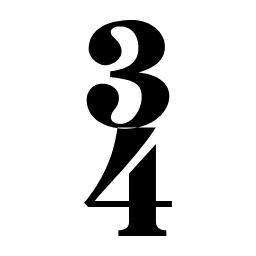

# Clef recognizer inputs

These are the exact post-sanity-filter vector candidates sent to `IClefRecognizer`.

`Legacy IoU` is the old shape-matching baseline: bbox-normalized 64x64 binary-mask IoU plus Clipper2 vector IoU. No size or staff-position prior is used.

`Skeleton` is the raw scanline-midpoint graph. `lines` traces that graph into chains and simplifies each chain with Ramer-Douglas-Peucker; no smoothing yet.

| Candidate | P+M | Logical bbox | Vector recognizer | Legacy IoU | Shape | Skeleton |
|---|---|---|---|---|---|---|
| [001](001.txt) | P1-M1 | `X 0.9..3.32, Y -3.36..11.52` | none (Open-set rejection: nearest/ref=0.918 (max 0.72), margin/ref=0.541 (min 0.2).) | G 89.5 % |  | [raw](001.skeleton.svg) · [lines](001.skeleton-lines.svg) |
| [002](002.txt) | P1-M1 | `X 4.21..5.62, Y 0.07..7.89` | none (Open-set rejection: nearest/ref=0.918 (max 0.72), margin/ref=0.541 (min 0.2).) | G 37.9 % |  | [raw](002.skeleton.svg) · [lines](002.skeleton-lines.svg) |
| [003](003.txt) | P2-M1 | `X 0.75..2.73, Y 0..6.69` | none (Open-set rejection: nearest/ref=0.918 (max 0.72), margin/ref=0.541 (min 0.2).) | F 79.6 % |  | [raw](003.skeleton.svg) · [lines](003.skeleton-lines.svg) |
| [004](004.txt) | P2-M1 | `X 4.21..5.62, Y 0.07..7.89` | none (Open-set rejection: nearest/ref=0.918 (max 0.72), margin/ref=0.541 (min 0.2).) | G 37.9 % |  | [raw](004.skeleton.svg) · [lines](004.skeleton-lines.svg) |
| [005](005.txt) | P1-M5 | `X 0.93..3.44, Y -3.36..11.52` | none (Open-set rejection: nearest/ref=0.918 (max 0.72), margin/ref=0.541 (min 0.2).) | G 89.5 % |  | [raw](005.skeleton.svg) · [lines](005.skeleton-lines.svg) |
| [006](006.txt) | P2-M5 | `X 0.77..2.83, Y 0..6.69` | none (Open-set rejection: nearest/ref=0.918 (max 0.72), margin/ref=0.541 (min 0.2).) | F 79.6 % |  | [raw](006.skeleton.svg) · [lines](006.skeleton-lines.svg) |
| [007](007.txt) | P2-M6 | `X 8.71..10.1, Y -7.75..0.06` | none (Open-set rejection: nearest/ref=0.918 (max 0.72), margin/ref=0.541 (min 0.2).) | F 26.2 % |  | [raw](007.skeleton.svg) · [lines](007.skeleton-lines.svg) |
| [008](008.txt) | P1-M9 | `X 0.98..3.63, Y -3.36..11.52` | none (Open-set rejection: nearest/ref=0.918 (max 0.72), margin/ref=0.541 (min 0.2).) | G 89.5 % |  | [raw](008.skeleton.svg) · [lines](008.skeleton-lines.svg) |
| [009](009.txt) | P1-M9 | `X 12.09..16.22, Y -0.36..8.06` | none (Open-set rejection: nearest/ref=0.918 (max 0.72), margin/ref=0.541 (min 0.2).) | F 15.5 % |  | [raw](009.skeleton.svg) · [lines](009.skeleton-lines.svg) |
| [010](010.txt) | P1-M9 | `X 13.23..16.22, Y -0.36..6.77` | none (Open-set rejection: nearest/ref=0.918 (max 0.72), margin/ref=0.541 (min 0.2).) | F 14.0 % |  | [raw](010.skeleton.svg) · [lines](010.skeleton-lines.svg) |
| [011](011.txt) | P2-M9 | `X 0.82..2.99, Y -0..6.69` | none (Open-set rejection: nearest/ref=0.918 (max 0.72), margin/ref=0.541 (min 0.2).) | F 79.6 % |  | [raw](011.skeleton.svg) · [lines](011.skeleton-lines.svg) |
| [012](012.txt) | P1-M13 | `X 0.91..3.36, Y -3.36..11.52` | none (Open-set rejection: nearest/ref=0.918 (max 0.72), margin/ref=0.541 (min 0.2).) | G 89.5 % |  | [raw](012.skeleton.svg) · [lines](012.skeleton-lines.svg) |
| [013](013.txt) | P2-M13 | `X 0.76..2.76, Y 0..6.69` | none (Open-set rejection: nearest/ref=0.918 (max 0.72), margin/ref=0.541 (min 0.2).) | F 79.6 % |  | [raw](013.skeleton.svg) · [lines](013.skeleton-lines.svg) |
| [014](014.txt) | P1-M17 | `X 0.86..3.18, Y -3.36..11.52` | none (Open-set rejection: nearest/ref=0.918 (max 0.72), margin/ref=0.541 (min 0.2).) | G 89.5 % |  | [raw](014.skeleton.svg) · [lines](014.skeleton-lines.svg) |
| [015](015.txt) | P1-M17 | `X 12.14..14.15, Y -4.86..3.06` | none (Open-set rejection: nearest/ref=0.918 (max 0.72), margin/ref=0.541 (min 0.2).) | F 20.1 % |  | [raw](015.skeleton.svg) · [lines](015.skeleton-lines.svg) |
| [016](016.txt) | P1-M17 | `X 13.15..14.15, Y -4.86..2.27` | none (Open-set rejection: nearest/ref=0.918 (max 0.72), margin/ref=0.541 (min 0.2).) | F 22.2 % |  | [raw](016.skeleton.svg) · [lines](016.skeleton-lines.svg) |
| [017](017.txt) | P2-M17 | `X 0.72..2.62, Y -0..6.69` | none (Open-set rejection: nearest/ref=0.918 (max 0.72), margin/ref=0.541 (min 0.2).) | F 79.6 % |  | [raw](017.skeleton.svg) · [lines](017.skeleton-lines.svg) |
| [018](018.txt) | P1-M18 | `X 9.87..12.26, Y -4.86..3.06` | none (Open-set rejection: nearest/ref=0.918 (max 0.72), margin/ref=0.541 (min 0.2).) | F 20.1 % |  | [raw](018.skeleton.svg) · [lines](018.skeleton-lines.svg) |
| [019](019.txt) | P1-M18 | `X 11.07..12.26, Y -4.86..2.27` | none (Open-set rejection: nearest/ref=0.918 (max 0.72), margin/ref=0.541 (min 0.2).) | F 22.2 % |  | [raw](019.skeleton.svg) · [lines](019.skeleton-lines.svg) |
